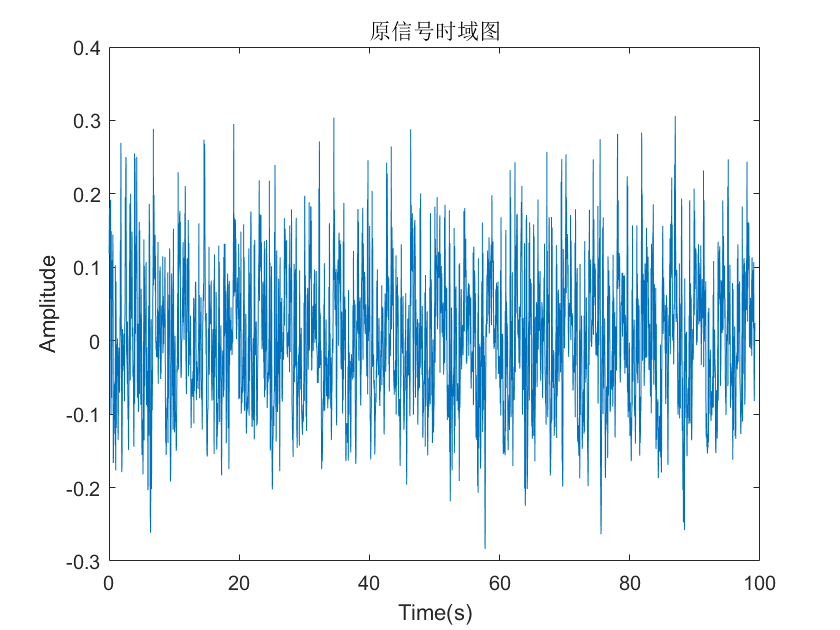
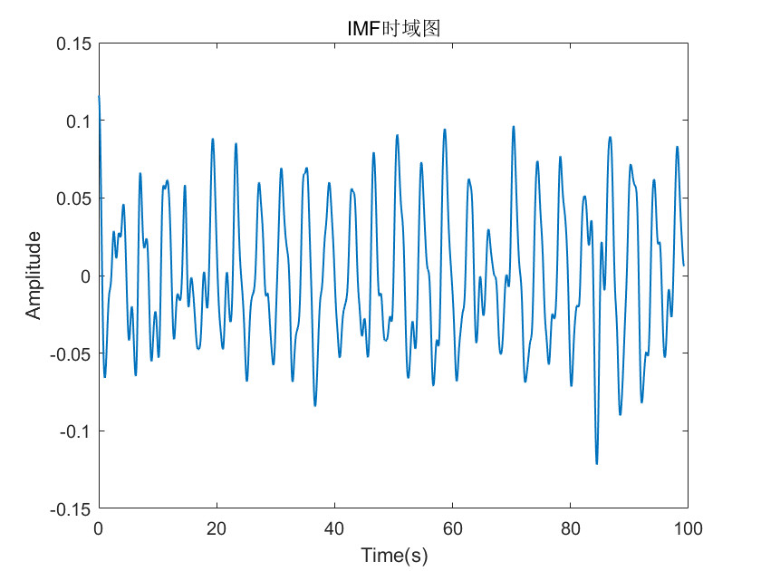
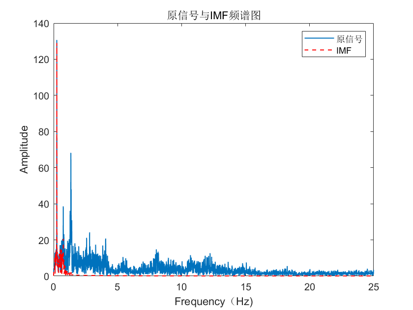

# Variational Mode Extraction变分模态提取
* 通过选择中心频域与带宽约束提取特定本征模态函数(IMF)
* 降低变分模态分解(VMD)时间复杂度
* 参考文献：Variational Mode Extraction: A New Efficient Method to Derive Respiratory Signals from ECG

# 例子
* 对雷达接收的相位差分信号提取低频分量

    
    
    

